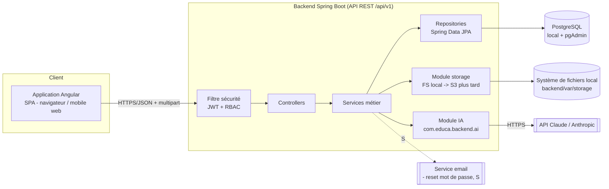
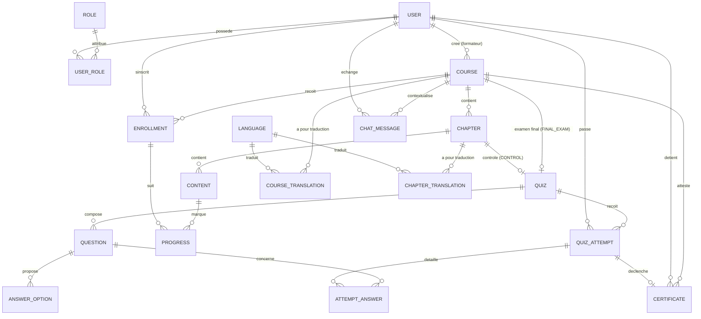

# 02 — Conception

Projet **educa**. Statut : *conception validée (Phase 0) et implémentée (Phases 1→6). Ce document décrit la cible de conception ; les écarts avec le code livré sont listés en §0.*
Dernière mise à jour : 2026-09-10.

---

## 0. État de réalisation — écarts conception ↔ implémentation

Le périmètre **Must have** est intégralement réalisé et vérifié (`docs/06-verification-mvp.md`).
Écarts à connaître en lisant la suite :

| § | Conception (ci-dessous) | Réalité du code livré |
|---|---|---|
| §1.1 / §7.2 | `LlmAiAssistant`, config `ai.provider` | classes réelles : `AiAssistant` → **`ClaudeAiAssistant`** (SDK `com.anthropic:anthropic-java`) / **`DisabledAiAssistant`** ; config `AI_ENABLED` / `ANTHROPIC_API_KEY` / `AI_MODEL` (pas de clé `ai.provider`) |
| §1.1 / §4 / §5 | Module **admin** (`/admin/users`, rôles, statut, registre certificats, langues) | **non développé** (Should have) — pas de contrôleur `/admin/**`. La promotion `INSTRUCTOR` se fait en base |
| §3 | `preferred_language` / `courses.language` en `CHAR(2)` ; `languages`, `*_translations`, `chat_messages` | colonnes en **`VARCHAR(2)`** (validation Hibernate 7) ; les tables i18n de contenu et `chat_messages` **ne sont pas** dans les migrations (`V1`/`V2`) — Should have |
| §4 | `options:[{… isCorrect …}]` ; `verify` renvoie `score` ; `409` si examen verrouillé | champ JSON **`correct`** ; `verify` renvoie **`finalGrade`** ; examen verrouillé → **`403`** (le `409` reste pour « tentatives épuisées ») |
| §6.1 | `frontend/src/assets/i18n/` | fichiers réellement servis depuis **`frontend/public/i18n/`** (Angular 19 + ngx-translate v18) |
| §8 | PDF « à confirmer » ; Swagger UI ; conteneurisation « reportée » | PDF = **`openhtmltopdf-pdfbox` 1.0.10** (figé) ; **Swagger non intégré** (springdoc pas compatible Spring Boot 4 — tâche 1.10 en attente) ; **stack Docker livrée** en Phase 6.6 (`docs/07-deploiement.md`) |
| §5 | rate limiting `/auth/login` & `/ai/chat` | Should have — non implémenté |

Le reste du document correspond à ce qui a été construit.

---

## 1. Architecture générale



> Version exportée pour le mémoire (source Mermaid + SVG/PNG) : [`assets/architecture.mmd`](assets/architecture.mmd) · [`assets/architecture.svg`](assets/architecture.svg).

**Principes** :
- Frontend = SPA Angular, aucun rendu serveur ; consomme uniquement l'API REST.
- Backend sans état : l'identité voyage dans le JWT, aucune session serveur → scalabilité horizontale simple.
- Un seul point d'entrée réseau côté API ; le filtre de sécurité s'exécute avant tout controller.
- Le module IA est le **seul** composant qui connaît le fournisseur LLM ; le reste du code appelle une interface `AiAssistant`.
- Les fichiers passent par l'API en **multipart** ; le module `storage` abstrait le support (système de fichiers local en dev, S3-compatible plus tard) et fournit des URLs de téléchargement.

### 1.1 Organisation en modules (*package-by-feature*)

**Règle structurante** : chaque entité / concept métier est géré comme un **module autonome** qui regroupe
toutes ses couches (organisation *par domaine fonctionnel*, pas *par couche technique*). Un module contient
son entité, son repository, son service, son controller, ses DTO et son mapper. On ne crée pas de packages
transverses `controllers/`, `services/`, `repositories/` : tout ce qui concerne `course` vit dans le package
`course`.

#### Backend (`com.educa.backend`)

```
com.educa.backend
├── BackendApplication.java
├── common/                 # transverse, non métier
│   ├── error/              # @RestControllerAdvice, ApiError, exceptions
│   ├── web/                # config CORS, en-têtes sécurité, pagination
│   └── util/
├── security/               # JWT, filtre, SecurityFilterChain, @CurrentUser, contrôle d'accès objet
├── user/                   # module : compte + auth + rôles
│   ├── User.java                 (entité JPA)
│   ├── Role.java
│   ├── UserRepository.java
│   ├── RoleRepository.java
│   ├── AuthService.java          (register, login, refresh, logout)
│   ├── UserService.java          (profil, gestion admin)
│   ├── AuthController.java       ( /api/v1/auth/** )
│   ├── AdminUserController.java  ( /api/v1/admin/users/** )
│   ├── dto/                      (RegisterRequest, LoginResponse, UserDto, ...)
│   └── UserMapper.java
├── course/                 # module : Course + Chapter + Content (agrégat)
│   ├── Course.java  Chapter.java  Content.java
│   ├── CourseRepository.java  ChapterRepository.java  ContentRepository.java
│   ├── CourseService.java  ChapterService.java  ContentService.java
│   ├── CourseController.java  ChapterController.java  ContentController.java
│   ├── dto/          └── CourseMapper.java
├── enrollment/            # module : Enrollment + Progress
├── quiz/                  # module : Quiz + Question + AnswerOption + QuizAttempt + AttemptAnswer
├── certificate/          # module : Certificate + génération PDF + vérification publique
├── storage/              # module : interface StorageService — FileSystemStorageService (dev), impl. S3 en cible
└── ai/                   # module : interface AiAssistant, LlmAiAssistant, DisabledAiAssistant, AiController
```

**Conventions de module (backend)**
- **Entité JPA** : jamais exposée hors du module ; les controllers échangent uniquement des **DTO**.
- **Repository** : `interface … extends JpaRepository<Entity, Long>` dans le module.
- **Service** : porte la logique métier + les règles d'autorisation objet (« est-ce bien mon cours ? ») ; annoté `@Transactional` au besoin.
- **Controller** : fin, délègue au service ; `@PreAuthorize` pour le RBAC de rôle ; préfixe `/api/v1/<ressource>`.
- **Mapper** : entité ⇄ DTO via **MapStruct** (`@Mapper(componentModel = "spring")`), figé en Phase 1. Entités annotées **Lombok** (`@Getter/@Setter`).
- **Visibilité** : préférer `package-private` pour ce qui n'a pas à sortir du module ; `public` uniquement pour l'API du module (service, DTO, controller).
- **Dépendances entre modules** : un module peut dépendre du **service** d'un autre (ex. `certificate` → `enrollment`), jamais de son repository ni de ses entités directement. Pas de dépendance circulaire.
- **Agrégats** : `Course/Chapter/Content` et `Quiz/Question/AnswerOption` forment chacun un agrégat cohérent regroupé dans un seul module (le cycle de vie des enfants suit le parent).

#### Frontend (Angular — miroir de la même logique)

```
frontend/src/app
├── core/                 # singletons transverses : AuthService, HttpInterceptor, guards, ErrorHandler
├── shared/               # composants/pipes/directives réutilisables (dont gestion RTL)
└── feature/
    ├── auth/             # login, register, pages + AuthApi service
    ├── catalog/          # catalogue public
    ├── course/           # consultation cours + widget chatbot
    ├── instructor/       # espace formateur (cours, chapitres, contenus, quiz)
    ├── quiz/             # passage de quiz + résultats
    ├── certificate/      # mes certificats + vérification publique
    └── admin/            # utilisateurs, rôles, langues, registre certificats
```

Chaque dossier `feature/<x>/` est autonome : ses composants, son `‹x›-routing`, ses modèles TypeScript et
son service d'accès API (`<X>ApiService`, seul endroit qui appelle `HttpClient` pour ce domaine).
Chargement **lazy** par route.

---

## 2. Modèle conceptuel de données (MCD)



> Version exportée pour le mémoire : [`assets/mcd.mmd`](assets/mcd.mmd) · [`assets/mcd.svg`](assets/mcd.svg) — avec les attributs des **15 tables du MVP réellement migrées** (Flyway `V1`/`V2`). Les entités `*_TRANSLATION` / `LANGUAGE` / `CHAT_MESSAGE` ci-dessus restent au stade conception (*Should have*).

### Cardinalités et règles de gestion

| Relation | Cardinalité | Règle |
|---|---|---|
| USER – ROLE | N–N (via `USER_ROLE`) | Un utilisateur a ≥ 1 rôle. MVP : un seul rôle courant, modèle N–N conservé pour l'évolutivité. |
| USER – COURSE | 1–N | Un cours a exactement un formateur propriétaire ; un formateur a 0..N cours. |
| COURSE – CHAPTER | 1–N | Chapitre ordonné (`position`), supprimé en cascade avec le cours. |
| CHAPTER – CONTENT | 1–N | Contenu typé (`VIDEO`/`DOCUMENT`/`TEXT`), ordonné. |
| CHAPTER – QUIZ (CONTROL) | 1–0..1 | Au plus **un contrôle par chapitre**. Tentatives illimitées. |
| COURSE – QUIZ (FINAL_EXAM) | 1–0..1 | **Un examen final par cours**, couvre tous les chapitres. Tentatives limitées (`max_attempts`, défaut 3). Déverrouillé à 100 % de progression. |
| QUIZ – QUESTION | 1–N | Question ordonnée ; `points` par défaut 1. |
| QUESTION – ANSWER_OPTION | 1–N | ≥ 2 options ; ≥ 1 marquée `is_correct`. Pour `TRUE_FALSE` : exactement 2 options. |
| USER – ENROLLMENT – COURSE | N–N décomposée | Unicité (`user_id`, `course_id`). Statut : `ACTIVE`/`COMPLETED`/`CANCELLED`. |
| ENROLLMENT – PROGRESS – CONTENT | via `PROGRESS` | Une ligne par contenu vu ; unicité (`enrollment_id`, `content_id`). |
| USER – QUIZ_ATTEMPT – QUIZ | N–N décomposée | Une tentative = un passage horodaté ; `score`, `passed`. Score retenu par quiz = **meilleure** tentative. |
| QUIZ_ATTEMPT – ATTEMPT_ANSWER | 1–N | Réponses de l'apprenant figées au moment du passage (snapshot). |
| QUIZ_ATTEMPT (FINAL_EXAM) – CERTIFICATE | 1–0..1 | Certificat créé quand une tentative d'examen final porte la **note finale pondérée** ≥ `courses.pass_threshold`, s'il n'en existe pas déjà pour (`user`, `course`). Voir §3 « Règle de notation ». |
| LANGUAGE – *_TRANSLATION | 1–N | Traductions de contenu (Should have). L'i18n d'interface est gérée côté frontend (fichiers), pas en base. |
| USER/COURSE – CHAT_MESSAGE | 1–N | Historique du chatbot par (utilisateur, cours). Persistance = Should have ; en Must have le chat peut être sans état. |

---

## 3. Schéma de base de données (PostgreSQL)

> Conventions : `snake_case`, PK `id BIGINT GENERATED ALWAYS AS IDENTITY`, `created_at`/`updated_at TIMESTAMPTZ`, FK avec `ON DELETE CASCADE` là où la vie de l'enfant dépend du parent. Migrations Flyway (`V1__init.sql`, …).

### Tables — cœur MVP

```
users
  id PK
  email               VARCHAR(255) UNIQUE NOT NULL
  password_hash       VARCHAR(255) NOT NULL
  full_name           VARCHAR(150) NOT NULL
  preferred_language  VARCHAR(2) NOT NULL DEFAULT 'fr'   -- fr | en | ar  (CHAR(2) en conception, VARCHAR(2) au final : validation Hibernate 7)
  enabled             BOOLEAN NOT NULL DEFAULT TRUE
  created_at, updated_at

roles
  id PK
  name   VARCHAR(30) UNIQUE NOT NULL     -- LEARNER | INSTRUCTOR | ADMIN

user_roles
  user_id  FK -> users(id) ON DELETE CASCADE
  role_id  FK -> roles(id) ON DELETE CASCADE
  PRIMARY KEY (user_id, role_id)

refresh_tokens
  id PK
  user_id     FK -> users(id) ON DELETE CASCADE
  token_hash  VARCHAR(255) NOT NULL
  expires_at  TIMESTAMPTZ NOT NULL
  revoked     BOOLEAN NOT NULL DEFAULT FALSE
  created_at

courses
  id PK
  instructor_id   FK -> users(id)                -- propriétaire (rôle INSTRUCTOR)
  title           VARCHAR(200) NOT NULL
  slug            VARCHAR(220) UNIQUE NOT NULL
  description     TEXT
  language        VARCHAR(2) NOT NULL DEFAULT 'fr'  -- langue d'origine du contenu
  published       BOOLEAN NOT NULL DEFAULT FALSE
  control_weight  INT NOT NULL DEFAULT 40        -- % des contrôles dans la note finale
  exam_weight     INT NOT NULL DEFAULT 60        -- % de l'examen final  (control_weight + exam_weight = 100)
  pass_threshold  INT NOT NULL DEFAULT 70        -- note finale pondérée minimale pour obtenir le certificat
  created_at, updated_at

chapters
  id PK
  course_id   FK -> courses(id) ON DELETE CASCADE
  title       VARCHAR(200) NOT NULL
  position    INT NOT NULL
  UNIQUE (course_id, position)

contents
  id PK
  chapter_id   FK -> chapters(id) ON DELETE CASCADE
  type         VARCHAR(15) NOT NULL       -- VIDEO | DOCUMENT | TEXT
  title        VARCHAR(200) NOT NULL
  position     INT NOT NULL
  text_body    TEXT                       -- si type = TEXT
  file_key     VARCHAR(500)               -- clé de stockage si VIDEO|DOCUMENT (chemin relatif local en dev, clé objet en cible)
  file_name    VARCHAR(255)
  mime_type    VARCHAR(100)
  UNIQUE (chapter_id, position)

quizzes
  id PK
  course_id       FK -> courses(id) ON DELETE CASCADE       -- toujours renseigné
  chapter_id      FK -> chapters(id) ON DELETE CASCADE      -- renseigné si type = CONTROL ; NULL si FINAL_EXAM
  type            VARCHAR(12) NOT NULL                      -- CONTROL | FINAL_EXAM
  title           VARCHAR(200) NOT NULL
  pass_threshold  INT NOT NULL DEFAULT 50                   -- seuil indicatif réussi/échoué de CE quiz (affichage)
  max_attempts    INT                                       -- NULL = illimité (CONTROL) ; ex. 3 (FINAL_EXAM)
  created_at, updated_at
  -- 1 contrôle max par chapitre :  UNIQUE (chapter_id) WHERE type = 'CONTROL'
  -- 1 examen final max par cours : UNIQUE (course_id)  WHERE type = 'FINAL_EXAM'

questions
  id PK
  quiz_id   FK -> quizzes(id) ON DELETE CASCADE
  statement TEXT NOT NULL
  type      VARCHAR(20) NOT NULL     -- SINGLE_CHOICE | MULTIPLE_CHOICE | TRUE_FALSE
  points    INT NOT NULL DEFAULT 1
  position  INT NOT NULL
  UNIQUE (quiz_id, position)

answer_options
  id PK
  question_id  FK -> questions(id) ON DELETE CASCADE
  label        TEXT NOT NULL
  is_correct   BOOLEAN NOT NULL DEFAULT FALSE
  position     INT NOT NULL

enrollments
  id PK
  user_id      FK -> users(id) ON DELETE CASCADE
  course_id    FK -> courses(id) ON DELETE CASCADE
  status       VARCHAR(15) NOT NULL DEFAULT 'ACTIVE'   -- ACTIVE | COMPLETED | CANCELLED
  enrolled_at  TIMESTAMPTZ NOT NULL DEFAULT now()
  completed_at TIMESTAMPTZ
  UNIQUE (user_id, course_id)

progress
  id PK
  enrollment_id  FK -> enrollments(id) ON DELETE CASCADE
  content_id     FK -> contents(id) ON DELETE CASCADE
  completed_at   TIMESTAMPTZ NOT NULL DEFAULT now()
  UNIQUE (enrollment_id, content_id)

quiz_attempts
  id PK
  user_id       FK -> users(id) ON DELETE CASCADE
  quiz_id       FK -> quizzes(id) ON DELETE CASCADE
  score         NUMERIC(5,2) NOT NULL        -- pourcentage obtenu
  passed        BOOLEAN NOT NULL
  started_at    TIMESTAMPTZ NOT NULL
  submitted_at  TIMESTAMPTZ NOT NULL

attempt_answers
  id PK
  attempt_id            FK -> quiz_attempts(id) ON DELETE CASCADE
  question_id           FK -> questions(id)
  selected_option_ids   BIGINT[]            -- options cochées par l'apprenant
  correct               BOOLEAN NOT NULL

certificates
  id PK
  user_id               FK -> users(id) ON DELETE CASCADE
  course_id             FK -> courses(id) ON DELETE CASCADE
  final_exam_attempt_id FK -> quiz_attempts(id)          -- tentative d'examen final déclencheuse
  controls_average      NUMERIC(5,2) NOT NULL            -- moyenne des meilleurs scores de contrôle
  final_exam_score      NUMERIC(5,2) NOT NULL            -- meilleur score d'examen final
  final_grade           NUMERIC(5,2) NOT NULL            -- note finale pondérée (voir règle ci-dessous)
  serial_number         VARCHAR(40) UNIQUE NOT NULL      -- ex. EDUCA-2026-000123
  verification_code     VARCHAR(64) UNIQUE NOT NULL      -- token public de vérification
  issued_at             TIMESTAMPTZ NOT NULL DEFAULT now()
  pdf_key               VARCHAR(500)                     -- clé objet du PDF généré
  UNIQUE (user_id, course_id)
```

### Règle de notation et de certification (cœur métier)

- **Contrôle de chapitre** (`quiz.type = CONTROL`) : un quiz par chapitre, tentatives **illimitées**. Score retenu pour le chapitre = **meilleure** tentative.
- **Moyenne des contrôles** = moyenne arithmétique des meilleurs scores de chaque chapitre doté d'un contrôle. Un contrôle jamais tenté compte **0**.
- **Progression du cours = 100 %** quand : (a) tous les `contents` du cours ont une ligne `progress` pour l'inscription **ET** (b) chaque contrôle de chapitre a **≥ 1 tentative** de l'apprenant (le score du contrôle n'entre pas dans ce déverrouillage).
- **Examen final** (`quiz.type = FINAL_EXAM`) : un quiz par cours couvrant tous les chapitres. **Accessible uniquement à 100 % de progression.** Tentatives **limitées** (`quizzes.max_attempts`, défaut 3). Score retenu = **meilleure** tentative d'examen.
- **Note finale pondérée** = `courses.control_weight%` × moyenne des contrôles + `courses.exam_weight%` × meilleur score d'examen final. Défaut : **40 % / 60 %**.
- **Délivrance du certificat** : dès qu'une tentative d'examen final porte la note finale à **≥ `courses.pass_threshold`** (défaut 70 %), un `certificate` est créé (si aucun n'existe pour ce couple utilisateur/cours), avec `controls_average`, `final_exam_score`, `final_grade`. L'enrollment passe à `COMPLETED`.
- **Exemple** : contrôles [80, 60, 70] → moyenne 70 ; examen final 75 → note finale = 0,40 × 70 + 0,60 × 75 = **73** ≥ 70 → certificat délivré.

### Tables — multilingue de contenu (Should have)

```
languages
  code     CHAR(2) PK        -- fr | en | ar
  name     VARCHAR(50) NOT NULL
  rtl      BOOLEAN NOT NULL DEFAULT FALSE
  enabled  BOOLEAN NOT NULL DEFAULT TRUE

course_translations
  id PK
  course_id     FK -> courses(id) ON DELETE CASCADE
  language_code CHAR(2) FK -> languages(code)
  title         VARCHAR(200) NOT NULL
  description   TEXT
  UNIQUE (course_id, language_code)

chapter_translations
  id PK
  chapter_id    FK -> chapters(id) ON DELETE CASCADE
  language_code CHAR(2) FK -> languages(code)
  title         VARCHAR(200) NOT NULL
  UNIQUE (chapter_id, language_code)
```

### Tables — chatbot (Should have : persistance)

```
chat_messages
  id PK
  user_id    FK -> users(id) ON DELETE CASCADE
  course_id  FK -> courses(id) ON DELETE SET NULL
  role       VARCHAR(10) NOT NULL       -- USER | ASSISTANT
  content    TEXT NOT NULL
  created_at TIMESTAMPTZ NOT NULL DEFAULT now()
```

### Index principaux
`courses(slug)`, `courses(published)`, `enrollments(user_id)`, `enrollments(course_id)`,
`quiz_attempts(user_id, quiz_id)`, `certificates(verification_code)`, `progress(enrollment_id)`.

---

## 4. Spécification API (REST, périmètre MVP)

Base : `/api/v1`. Auth : header `Authorization: Bearer <access_token>` sauf mention « public ».
Format d'erreur homogène : `{ "timestamp", "status", "error", "message", "path", "fieldErrors": [...] }`.
Pagination : `?page=0&size=20`, réponse `{ content, page, size, totalElements, totalPages }`.

### Authentification
| Méthode | Endpoint | Rôle | Entrée | Sortie |
|---|---|---|---|---|
| POST | `/auth/register` | public | `{email, password, fullName, preferredLanguage?}` | `201` `{id, email, fullName, roles}` |
| POST | `/auth/login` | public | `{email, password}` | `200` `{accessToken, refreshToken, expiresIn, user}` |
| POST | `/auth/refresh` | public | `{refreshToken}` | `200` `{accessToken, refreshToken, expiresIn}` |
| POST | `/auth/logout` | authentifié | `{refreshToken}` | `204` |
| GET | `/auth/me` | authentifié | – | `200` `{id, email, fullName, roles, preferredLanguage}` |
| PATCH | `/auth/me` | authentifié | `{fullName?, preferredLanguage?}` | `200` profil |

### Cours & chapitres & contenus
| Méthode | Endpoint | Rôle | Notes |
|---|---|---|---|
| GET | `/courses` | public | catalogue des cours `published=true` ; filtres `?q=&language=` |
| GET | `/courses/{slug}` | public | détail (chapitres + contenus si inscrit ou propriétaire/admin) |
| POST | `/courses` | INSTRUCTOR | crée un cours (propriétaire = utilisateur courant) |
| PUT | `/courses/{id}` | INSTRUCTOR (propriétaire) / ADMIN | maj |
| DELETE | `/courses/{id}` | INSTRUCTOR (propriétaire) / ADMIN | |
| POST | `/courses/{id}/publish` · `/unpublish` | INSTRUCTOR (propriétaire) / ADMIN | |
| GET | `/instructor/courses` | INSTRUCTOR | mes cours (publiés ou non) |
| POST | `/courses/{courseId}/chapters` | INSTRUCTOR (propriétaire) | `{title, position}` |
| PUT/DELETE | `/chapters/{id}` | INSTRUCTOR (propriétaire) | |
| POST | `/chapters/{chapterId}/contents` | INSTRUCTOR (propriétaire) | `{type, title, position, textBody?}` |
| POST | `/contents/{id}/file` | INSTRUCTOR (propriétaire) | upload **multipart** (`file`) ; le module `storage` écrit le fichier et renvoie `fileKey` ; contrôle MIME + taille max |
| GET | `/contents/{id}/file` | inscrit / propriétaire / ADMIN | flux binaire du fichier (le module `storage` le lit ; en cible S3 : redirection vers URL pré-signée) |
| PUT/DELETE | `/contents/{id}` | INSTRUCTOR (propriétaire) | |

### Inscription & progression
| Méthode | Endpoint | Rôle | Notes |
|---|---|---|---|
| POST | `/courses/{id}/enroll` | LEARNER | crée l'inscription |
| GET | `/enrollments/me` | LEARNER | mes formations + % d'avancement |
| POST | `/contents/{id}/complete` | LEARNER (inscrit) | marque le contenu comme vu |
| GET | `/courses/{id}/progress` | LEARNER (inscrit) | détail progression |

### Quiz & tentatives
| Méthode | Endpoint | Rôle | Notes |
|---|---|---|---|
| POST | `/chapters/{chapterId}/control-quiz` | INSTRUCTOR (propriétaire) | crée le contrôle du chapitre (`type=CONTROL`, 1 max) `{title, maxAttempts?=null}` |
| POST | `/courses/{courseId}/final-exam` | INSTRUCTOR (propriétaire) | crée l'examen final (`type=FINAL_EXAM`, 1 max) `{title, maxAttempts?=3}` |
| PUT/DELETE | `/quizzes/{id}` | INSTRUCTOR (propriétaire) | |
| POST | `/quizzes/{id}/questions` | INSTRUCTOR (propriétaire) | `{statement, type, points, position, options:[{label,isCorrect,position}]}` |
| PUT/DELETE | `/questions/{id}` | INSTRUCTOR (propriétaire) | |
| GET | `/quizzes/{id}` | LEARNER (inscrit) | énoncés **sans** `isCorrect` ; `403` si `FINAL_EXAM` et progression < 100 % ; INSTRUCTOR/ADMIN : version complète |
| POST | `/quizzes/{id}/attempts` | LEARNER (inscrit) | `{answers:[{questionId, selectedOptionIds:[]}]}` → `201` `{score, passed, correctCount, total}` ; si `FINAL_EXAM` : + `{finalGrade, controlsAverage, certificateId?}` ; `409` si `max_attempts` atteint ou examen verrouillé |
| GET | `/quizzes/{id}/attempts/me` | LEARNER | mes tentatives sur ce quiz |
| GET | `/courses/{id}/grade` | LEARNER (inscrit) | `{progressPercent, finalExamUnlocked, controlsAverage, perChapter:[{chapterId, bestScore, attempts}], finalExamBestScore, finalGrade, passThreshold, certificateId?}` |
| GET | `/instructor/courses/{id}/results` | INSTRUCTOR (propriétaire) | agrégat par apprenant : moyenne contrôles, meilleur examen, note finale, certificat |

### Certificats
| Méthode | Endpoint | Rôle | Notes |
|---|---|---|---|
| GET | `/certificates/me` | LEARNER | mes certificats |
| GET | `/certificates/{id}/download` | titulaire / ADMIN | flux PDF |
| GET | `/certificates/verify/{code}` | public | `{valid, holderName, courseTitle, issuedAt, score}` |

### Chatbot IA
| Méthode | Endpoint | Rôle | Notes |
|---|---|---|---|
| POST | `/ai/chat` | LEARNER (inscrit au cours) | `{courseId, message, history?}` → `{reply, degraded?}` ; `degraded=true` si repli |
| GET | `/ai/chat/{courseId}/history` | LEARNER | Should have (si persistance activée) |

### Administration
| Méthode | Endpoint | Rôle | Notes |
|---|---|---|---|
| GET | `/admin/users` | ADMIN | liste + recherche `?q=` |
| PATCH | `/admin/users/{id}/roles` | ADMIN | `{roles:["INSTRUCTOR"]}` |
| PATCH | `/admin/users/{id}/status` | ADMIN | `{enabled: false}` |
| GET | `/admin/certificates` | ADMIN | registre (Should have) |
| GET/PATCH | `/admin/languages` | ADMIN | gestion langues actives (Should have) |

---

## 5. Stratégie de sécurité

### Authentification
- **Mots de passe** : hachés avec **BCrypt** (force 10+). Jamais stockés ni logués en clair.
- **JWT d'accès** : signé HMAC-SHA256 (secret en variable d'environnement) ou RSA ; durée courte (15 min) ; claims `sub` (id), `roles`, `exp`, `iat`.
- **Refresh token** : opaque, aléatoire, **haché en base** (`refresh_tokens.token_hash`), durée 7–30 j, révocable, rotation à chaque usage.
- **Filtre** `JwtAuthenticationFilter` place l'`Authentication` dans le `SecurityContext` avant les controllers.
- **Déconnexion** : révocation du refresh token (`revoked=true`).

### Autorisation — RBAC
Sécurité au niveau endpoint (`SecurityFilterChain` + `@PreAuthorize`) **et** au niveau objet (vérification « est-ce bien mon cours ? »).

**Matrice des permissions**

| Domaine / action | LEARNER | INSTRUCTOR | ADMIN |
|---|:--:|:--:|:--:|
| S'inscrire / se connecter / gérer son profil | ✅ | ✅ | ✅ |
| Voir le catalogue public | ✅ | ✅ | ✅ |
| S'inscrire à un cours, suivre la progression | ✅ | ✅ (en tant qu'apprenant) | ✅ |
| Passer un quiz, obtenir un certificat | ✅ | ✅ | ✅ |
| Utiliser le chatbot (cours où l'on est inscrit) | ✅ | ✅ | ✅ |
| Créer / modifier / supprimer **ses** cours, chapitres, contenus | ❌ | ✅ (propriétaire) | ✅ (tous) |
| Publier / dépublier **ses** cours | ❌ | ✅ (propriétaire) | ✅ |
| Créer / modifier quiz & questions de **ses** cours | ❌ | ✅ (propriétaire) | ✅ |
| Voir les résultats des inscrits de **ses** quiz | ❌ | ✅ (propriétaire) | ✅ |
| Modifier / supprimer le cours d'un **autre** formateur | ❌ | ❌ | ✅ |
| Lister / rechercher tous les utilisateurs | ❌ | ❌ | ✅ |
| Attribuer / retirer des rôles | ❌ | ❌ | ✅ |
| Activer / désactiver un compte | ❌ | ❌ | ✅ |
| Consulter le registre des certificats | ❌ | ❌ | ✅ |
| Gérer les langues actives | ❌ | ❌ | ✅ |

**Règles d'accès objet notables**
- `GET /quizzes/{id}` renvoie les bonnes réponses **uniquement** au propriétaire du cours ou à un ADMIN ; l'apprenant reçoit les énoncés et options sans `isCorrect`.
- Le contenu d'un cours (chapitres/contenus, fichiers) n'est accessible qu'aux inscrits, au propriétaire ou à un ADMIN.
- `POST /ai/chat` exige une inscription active au `courseId` fourni.

### Autres mesures
- **Validation des entrées** : `jakarta.validation` sur tous les DTO ; rejet `400` avec `fieldErrors`.
- **Injections** : accès BDD exclusivement via JPA / requêtes paramétrées.
- **CORS** : origine du frontend en liste blanche par configuration.
- **Transport** : HTTPS en production (terminaison TLS au reverse proxy).
- **En-têtes** : `X-Content-Type-Options`, `X-Frame-Options`, `Referrer-Policy` via config Spring Security.
- **Secrets** : `.env` non versionné + variables d'environnement ; `.env.example` fourni.
- **Rate limiting** (Should have) : sur `/auth/login` et `/ai/chat`.
- **Uploads** : contrôle du type MIME et de la taille ; noms de fichiers régénérés (non exécutables) ; stockage hors du dossier servi statiquement (dossier `storage` dédié en dev, bucket privé en cible).
- **Journalisation** : logs structurés, jamais de secret ni de mot de passe ; trace des accès admin sensibles.

---

## 6. Stratégie multilingue (i18n) — FR / EN / AR

Deux niveaux distincts :

### 6.1 i18n de l'interface (Must have)
- Librairie : **`@ngx-translate/core` v18** + `@ngx-translate/http-loader` (`provideTranslateHttpLoader`).
- Fichiers de traduction : **`frontend/public/i18n/{fr,en,ar}.json`** (clé → texte) — servis à la racine (`i18n/…`) par Angular 19.
- Langue par défaut `fr` ; détection à la connexion via `user.preferredLanguage` ; sélecteur de langue dans l'en-tête ; persistance en `localStorage` **et** via `PATCH /auth/me`.
- **RTL** : au changement de langue, positionner `document.documentElement.dir = (lang === 'ar' ? 'rtl' : 'ltr')` et `lang`. Styles logiques CSS (`margin-inline-start`, `padding-inline-end`, Flexbox/Grid) plutôt que `left/right`. Vérifier icônes directionnelles (flèches « suivant / précédent ») et alignements.
- Formats dates/nombres via l'API `Intl` du navigateur selon la locale active.
- Police : famille compatible latin + arabe (ex. « Noto Sans » + « Noto Sans Arabic ») embarquée en local.

### 6.2 i18n du contenu pédagogique (Should have)
- Le contenu original d'un cours a une `language` (langue d'origine).
- Tables `course_translations`, `chapter_translations` : le formateur saisit les traductions (EF-28).
- À la lecture, l'API renvoie la traduction correspondant à `Accept-Language` / `?lang=` si elle existe, sinon la langue d'origine (fallback) + un indicateur `translated: false`.
- Les contenus riches (vidéos, documents) ne sont pas traduits automatiquement : le formateur peut fournir des contenus alternatifs par langue (hors périmètre MVP).
- EF-29 (traduction assistée par IA) : Could have, réutilise le service IA.

### 6.3 Langue des certificats
- Le PDF est généré dans la langue de préférence de l'apprenant au moment de l'émission ; libellés depuis un bundle serveur `messages_{fr,en,ar}.properties`. Gabarit RTL dédié pour l'arabe.

---

## 7. Stratégie IA

### 7.1 Cas d'usage
1. **Chatbot pédagogique (Must have)** — répond aux questions de l'apprenant sur le cours consulté.
2. Génération assistée de quiz (Should have).
3. Traduction / recommandation (Could have).

### 7.2 Architecture
- Interface `AiAssistant` dans `com.educa.backend.ai` :
  ```
  AiReply ask(AiChatRequest request);        // chatbot
  List<GeneratedQuestion> generateQuiz(...);  // Should have
  ```
- Implémentation **`ClaudeAiAssistant`** (SDK officiel `com.anthropic:anthropic-java`) = seul point qui connaît le fournisseur — tout en configuration (`AI_ENABLED`, `ANTHROPIC_API_KEY`, `AI_MODEL` défaut `claude-sonnet-5`, `AI_TIMEOUT_MS`, `AI_MAX_CONTEXT_CHARS`). `AiConfig` choisit le bean selon `educa.ai.enabled` **et** la présence de la clé.
- Implémentation **`DisabledAiAssistant`** (repli) : renvoie un message neutre avec `degraded=true`. Activée si l'IA est désactivée, la clé absente, ou **toute** erreur/timeout de l'appel (jamais d'exception propagée).

### 7.3 Prompt du chatbot (format)
- **System** : rôle = tuteur pédagogique d'educa ; règles = répondre uniquement dans le périmètre du cours fourni, dire quand l'information n'est pas dans le cours, répondre dans la langue de l'apprenant, ton bienveillant et concis.
- **Contexte** : titre + description du cours, titres des chapitres, et extrait(s) des contenus `TEXT` pertinents (longueur bornée, ex. 4000 caractères max ; troncature simple en MVP, recherche sémantique = amélioration ultérieure).
- **Historique** : les N derniers échanges (ex. 6 messages) transmis par le client.
- **User** : la question.

### 7.4 Coûts & latence
- `timeout` strict (ex. 15 s) → repli si dépassé.
- Longueur de contexte et de réponse bornées (`max_tokens`).
- Rate limiting par utilisateur sur `/ai/chat` (Should have).
- Compteur d'appels / logs pour estimer le coût pendant le PFE.
- Fonctionnalité désactivable globalement par `ai.enabled=false` (utile pour les démos hors ligne).

### 7.5 Sécurité IA
- La clé API ne quitte jamais le backend.
- Les entrées utilisateur ne sont jamais concaténées dans le rôle *system* ; séparation stricte system / user.
- Pas de données personnelles envoyées au LLM au-delà du strict nécessaire (pas d'email, pas d'identifiant).

---

## 8. Choix techniques justifiés

| Sujet | Choix | Justification | Alternatives écartées |
|---|---|---|---|
| Langage backend | **Java 25 + Spring Boot 4.1.1** | Squelette déjà généré ; écosystème mûr (Security, Data JPA, validation, tests) ; compétence attendue en contexte académique | Node/Express (prévu au brief initial) — abandonné car le squelette et la contrainte pédagogique pointent Java |
| Build backend | **Maven** (`mvnw` fourni) | Wrapper présent, configuration déclarative, standard Spring | Gradle |
| ORM / accès données | **Spring Data JPA / Hibernate** | Productivité CRUD, mapping objet, requêtes dérivées ; requêtes paramétrées par défaut (sécurité) | JOOQ, JDBC brut |
| Migrations | **Flyway** | Migrations SQL versionnées, rejouables, adaptées à un suivi de PFE | Liquibase, `ddl-auto` (proscrit hors dev) |
| Base de données | **PostgreSQL** | Robuste, gratuit, types riches (arrays, `TIMESTAMPTZ`), imposé au brief | MySQL |
| Environnement BDD (dev) | **PostgreSQL installé localement + pgAdmin** | Pas de Docker pour l'instant (choix de l'utilisatrice) ; pgAdmin pour l'administration visuelle. Bases `educa` (dev) et `educa_test` (tests) | docker-compose (reporté) |
| Auth | **JWT (access court + refresh haché) + BCrypt** | Backend sans état, standard, testable ; refresh révocable pour la déconnexion | Sessions serveur ; OAuth2 complet (surdimensionné pour un PFE) |
| Frontend | **Angular** (standalone components) | Choix explicite ; framework structurant (routing, DI, formulaires, i18n) adapté à une app à rôles multiples | Next.js/React (brief initial) — remplacé sur consigne |
| i18n frontend | **@ngx-translate/core** | Chargement dynamique des locales, changement de langue à chaud, gestion `dir` simple | i18n natif Angular (build par locale, moins souple pour bascule à chaud) |
| Stockage fichiers | Interface `storage` — **dev : système de fichiers local** (`FileSystemStorageService`, dossier `backend/var/storage/`, gitignoré) ; **cible : S3-compatible** (impl. ajoutée plus tard) | Le module `storage` abstrait le fournisseur ; on démarre sans dépendance externe, on branche S3/MinIO ensuite sans toucher au métier | Coupler le métier au SDK S3 dès le début |
| Génération PDF | **`openhtmltopdf-pdfbox` 1.0.10** (figé en Phase 3) | Template HTML/CSS → PDF, licence libre ; polices PDF standard (Helvetica) → aucune police système requise dans le conteneur | iText 7 (licence AGPL/commerciale), wkhtmltopdf (binaire externe) |
| Conteneurisation | **`docker-compose.yml` livré en Phase 6.6** : `backend/Dockerfile` (JRE 25), `frontend/Dockerfile` (Angular → nginx, reverse-proxy `/api`), `postgres:18` ; profil `prod` (`application-prod.yml`) | Cible de déploiement portable (VM Docker, base managée, PaaS). En dev, PostgreSQL reste local (poste sans Docker). Voir `docs/07-deploiement.md` | — |
| Tests backend | **JUnit 5 + Spring Boot Test** sur une base `educa_test` **PostgreSQL locale** (profil `test`, Flyway rejoué) — 30 tests | Vraie PostgreSQL, sans Docker. Testcontainers réservé à la CI si Docker disponible | H2 en mémoire (comportement divergent de Postgres) |
| Doc API | springdoc-openapi (Swagger UI) — **non intégré** (tâche 1.10) | Aucune version `springdoc` compatible Spring Boot 4 / Spring 7 au moment du développement ; à ajouter dès qu'une release compatible sort | Doc manuelle (les endpoints sont décrits en §4) |

**Dépendances Maven effectivement ajoutées** (Phases 1→4) : `spring-boot-starter-web`, `-data-jpa`, `-validation`, `spring-boot-flyway` + `flyway-core` + `flyway-database-postgresql`, `org.postgresql:postgresql`, `io.jsonwebtoken:jjwt` 0.12.6, **Lombok** + **MapStruct** 1.6.3 (via `annotationProcessorPaths`), `spring-boot-starter-webmvc-test` (tests), `openhtmltopdf-pdfbox` 1.0.10 (certificats), `com.anthropic:anthropic-java` (chatbot). (`spring-boot-starter-security` déjà présent.)
Non ajoutées : `springdoc-openapi` (pas de version compatible Spring Boot 4) ; client S3 (`software.amazon.awssdk:s3` / `io.minio:minio`) — quand on branchera le stockage objet ; `spring-boot-testcontainers` + `org.testcontainers:postgresql` — si CI avec Docker.

---

## 9. Wireframes texte

### 9.1 Dashboard apprenant (`/dashboard`)
```
┌───────────────────────────────────────────────────────────────┐
│ educa            [Catalogue] [Mes formations]      [FR▼] [Amina▼]│
├───────────────────────────────────────────────────────────────┤
│  Bonjour Amina 👋                                              │
│                                                               │
│  Mes formations en cours                                       │
│  ┌─────────────────────────┐ ┌─────────────────────────┐       │
│  │ Introduction à Python   │ │ Bases du marketing      │       │
│  │ ▓▓▓▓▓▓░░░░  62 %         │ │ ▓▓░░░░░░░░  20 %         │       │
│  │ [Reprendre]             │ │ [Reprendre]             │       │
│  └─────────────────────────┘ └─────────────────────────┘       │
│                                                               │
│  Mes certificats                                               │
│  • Git & GitHub — 2026-06-14 — score 88 %   [Télécharger PDF]  │
└───────────────────────────────────────────────────────────────┘
```

### 9.2 Page cours (`/courses/:slug`)
```
┌───────────────────────────────────────────────────────────────┐
│ ‹ Catalogue          Introduction à Python        [S'inscrire] │
├───────────────┬───────────────────────────────────────────────┤
│ CHAPITRES        │ Chapitre 2 — Les variables                 │
│ 1. Intro      ✓  │ ┌────────────────────────────────────────┐  │
│   • Contrôle  ✓  │ │           [ Lecteur vidéo ]            │  │
│ 2. Variables  ▶  │ └────────────────────────────────────────┘  │
│   • Vidéo     ▶  │ Texte du contenu ...                        │
│   • Contrôle     │ [Marquer comme terminé]  [Chapitre suivant ›]│
│ 3. Boucles       │                                            │
│ ▸ Examen final 🔒│ (débloqué à 100 % de progression)           │
├───────────────┴───────────────────────────────────────────────┤
│  💬 Assistant du cours                                     [_] │
│  Vous : "Quelle différence entre une liste et un tuple ?"      │
│  Assistant : "Dans ce cours, ..."                              │
│  [ Écrire une question...                            ] [Envoyer]│
└───────────────────────────────────────────────────────────────┘
```

### 9.3 Page quiz (`/quizzes/:id`)
```
┌───────────────────────────────────────────────────────────────┐
│ Examen final — Introduction à Python     Seuil du cours : 70 % │
├───────────────────────────────────────────────────────────────┤
│ Question 3 / 10                                        1 point │
│ Que renvoie len("educa") ?                                     │
│  ( ) 4      (•) 5      ( ) 6      ( ) Erreur                    │
│                                                               │
│                       [‹ Précédent]      [Suivant ›]           │
│                                       [Terminer et soumettre]  │
└───────────────────────────────────────────────────────────────┘
        ↓ après soumission d'un CONTRÔLE de chapitre
┌───────────────────────────────────────────────────────────────┐
│  Contrôle — Chapitre 2 : 70 %   (7 / 10)   Meilleur score : 80 %│
│  [Recommencer le contrôle]      [Chapitre suivant ›]           │
└───────────────────────────────────────────────────────────────┘

        ↓ après soumission de l'EXAMEN FINAL
┌───────────────────────────────────────────────────────────────┐
│  Examen final : 75 %   (tentative 1 / 3)                       │
│  Moyenne des contrôles : 70 %   →   Note finale : 73 %  ✅      │
│  (40 % contrôles + 60 % examen — seuil du cours : 70 %)         │
│  🎓 Certificat généré.                 [Télécharger le PDF]     │
│  [Revoir mes réponses]     [Voir le détail de ma note]         │
└───────────────────────────────────────────────────────────────┘
```

### 9.4 Dashboard formateur (`/instructor`)
```
┌───────────────────────────────────────────────────────────────┐
│ educa — Espace formateur                    [+ Nouveau cours]  │
├───────────────────────────────────────────────────────────────┤
│  Mes cours                                                     │
│  ┌────────────────────────────────────────────────────────┐    │
│  │ Introduction à Python     Publié    18 inscrits        │    │
│  │   [Éditer] [Chapitres] [Quiz] [Résultats] [Dépublier]  │    │
│  ├────────────────────────────────────────────────────────┤    │
│  │ Bases du marketing        Brouillon  0 inscrit         │    │
│  │   [Éditer] [Chapitres] [Quiz] [Résultats] [Publier]    │    │
│  └────────────────────────────────────────────────────────┘    │
│                                                               │
│  Résultats — « Introduction à Python »                         │
│  Apprenant   Moy. contrôles  Examen final  Note finale  Certif. │
│  Amina B.    70 %            75 %          73 %  ✅      délivré │
│  Yanis K.    55 %            60 %          58 %  ❌      —       │
└───────────────────────────────────────────────────────────────┘
```

### 9.5 Dashboard administrateur (`/admin`)
```
┌───────────────────────────────────────────────────────────────┐
│ educa — Administration                                         │
├──────────────┬────────────────────────────────────────────────┤
│ [Utilisateurs]│  Utilisateurs           [Rechercher: ______ ]  │
│ [Certificats] │  Nom          Email            Rôles     Actif │
│ [Langues]     │  Amina B.     amina@...        LEARNER    ✅    │
│               │    [Rôles ▾] [Désactiver]                      │
│               │  Karim K.     karim@...        INSTRUCTOR ✅    │
│               │    [Rôles ▾] [Désactiver]                      │
│               │                                               │
│               │  Registre des certificats                     │
│               │  EDUCA-2026-000123  Amina B.  Python  88 %     │
│               │    code: 7f3a...   [Vérifier]                  │
└──────────────┴────────────────────────────────────────────────┘
```

---

## 10. Décisions actées (revue du 2026-09-08)

1. **Un seul rôle actif** par utilisateur (`LEARNER` par défaut à l'inscription ; promotion `INSTRUCTOR` par l'admin). Table `user_roles` N–N conservée pour l'évolutivité.
2. **Deux niveaux de quiz** : un **contrôle** (`CONTROL`) par chapitre + un **examen final** (`FINAL_EXAM`) par cours. Voir §3 « Règle de notation et de certification ».
3. **Upload fichiers** : multipart via l'API ; le module `storage` écrit sur le **système de fichiers local** en dev (`FileSystemStorageService`), impl. S3-compatible + URL pré-signées = évolution ultérieure. En dev : PostgreSQL local + pgAdmin (pas de Docker sur le poste) ; **`docker-compose.yml` de déploiement ajouté en Phase 6.6** (voir `docs/07-deploiement.md`).
4. **Certification** : note finale pondérée **40 % contrôles / 60 % examen final** (`courses.control_weight` / `exam_weight`) ; seuil configurable par cours (`courses.pass_threshold`, défaut **70 %**) ; examen final déverrouillé à **100 % de progression** ; contrôles à tentatives **illimitées** (meilleur score retenu), examen final **limité** (défaut 3, meilleur score retenu).
5. **Chatbot sans persistance** au MVP (historique conservé côté navigateur). Table `chat_messages` = *Should have*.
6. **Fournisseur IA** : **API Claude / Anthropic** ; clé API avec plafond de dépense. Modèle exact et tarifs figés en Phase 4 (consulter la référence API Claude à ce moment-là).
